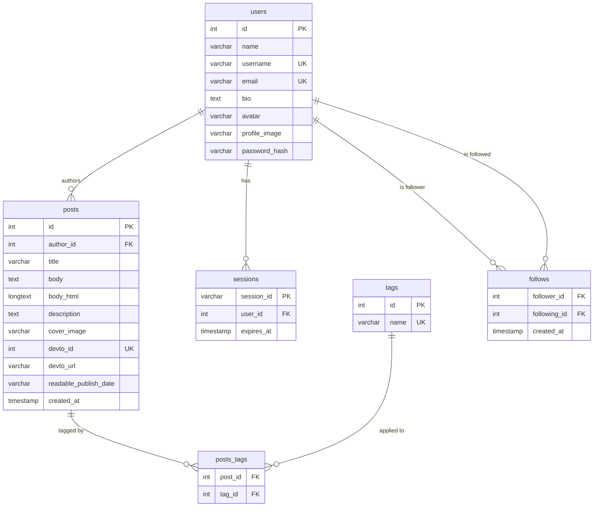

# PulseNet Database Schema

Source of truth: [`database/schema.sql`](../database/schema.sql).

A rendered ERD image is committed at [`db-diagram.png`](./db-diagram.png):

The same diagram is also kept as Mermaid in [`db-diagram.mmd`](./db-diagram.mmd).

## Exporting A PNG

Use one of these options:

1. Paste `docs/db-diagram.mmd` into mermaid.live and export PNG.
2. Preview the Mermaid diagram in VS Code with a Mermaid extension and save it.
3. Run `npx @mermaid-js/mermaid-cli -i docs/db-diagram.mmd -o docs/db-diagram.png`.
